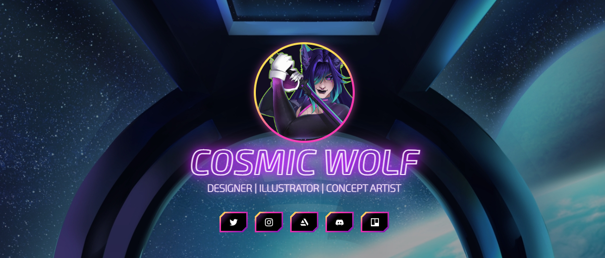

# CosmicWolf_Arts - Assets do site

Neste repositório estão armazenados todos os assets necessários para o funcionamento dos painéis customizados no [site CosmicWolfArts](https://https://sites.google.com/view/cosmicwolf).

Este projeto foi criado com o intuito de testar a ferramenta de criação de sites do Google e a viabilidade de uso de HTML/CSS nele, bem como aprender a estilizar e animar usando CSS. O código dos painéis foram inseridos na página com a função de *Incorporar código* e estão disponíveis na pasta `templates`:

>`templates/header.html` - Cabeçalho principal do site, com links de rede sociais ([Ver](https://htmlpreview.github.io/?https://github.com/DaniFluffyLab/cosmicwolf-webpage/blob/main/templates/header.html))  
>`templates/headerSimple.html` - Cabeçalho simplificado, com apenas título e um botão ([Ver](https://htmlpreview.github.io/?https://github.com/DaniFluffyLab/cosmicwolf-webpage/blob/main/templates/headerSimple.html))  
>`templates/button.html` - Botões separados, com icone e título ([Ver](https://htmlpreview.github.io/?https://github.com/DaniFluffyLab/cosmicwolf-webpage/blob/main/templates/button.html))  
>`templates/embedTwitch.html` - Player da twitch, acionado quando em live; caso offline, exibe um GIF ([Ver](https://htmlpreview.github.io/?https://github.com/DaniFluffyLab/cosmicwolf-webpage/blob/main/templates/embedTwitch.html))

A fonte "Exo 2" foi modificada a partir de sua versão disponível no [Google Fonts](https://fonts.google.com/specimen/Exo+2 "Abrir fonte original"). Para este projeto, utilizei o contorno da fonte, e, como ela originalmente não foi pensada para esse fim, algumas linhas usadas para o desenho das letras apareceram internamente. Para a edição, utilizei a função de remover sobreposições do [FontForge](https://github.com/fontforge/fontforge "Acessar projeto").

## Licenças de uso

Os icones do ArtStation, Discord, Instagram, Trello, Twitch e Twitter são de marcas de suas respectivas empresas.

Materiais artísticos são de propriedade de [Bianca Alvarenga](https://www.artstation.com/biancaalvarenga "Acessar ArtStation") e foram utilizados com consentimento da autora.

Quanto ao código e seu uso, segue os termos de uso [inspirados na Licença Beerware](https://people.freebsd.org/~phk/#:~:text=Beerware%2C%20am%20I%20really%20serious%20%3F):  
>*Faz o que você quiser com ele.* Se a gente se encontrar qualquer dia, e você achar que eu te ajudei, você pode me pagar uma coxinha e um refri :)
>(eu não bebo •- •)
